# Use case: Avoid promotional links in comments
Promotional links often use strange domain names, like `.finance`. With the anti-spam module, we can avoid this kind of link. Here, we will avoid `.finance` and `.shop` domains from being used, and when someone tries, we will signal the user to an admin.

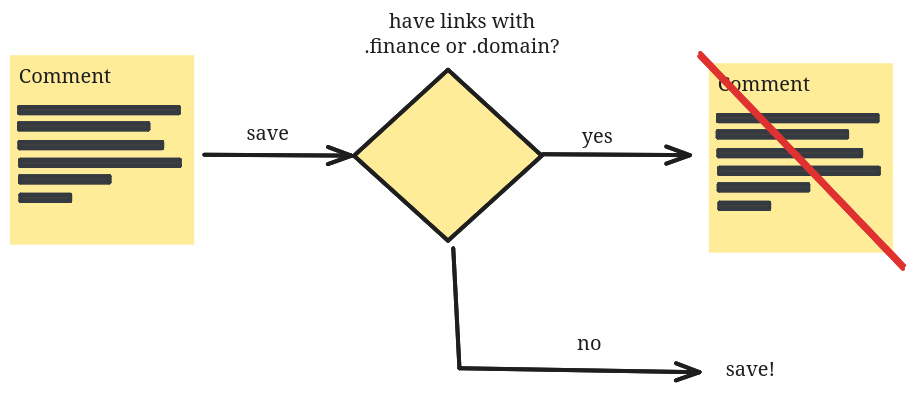

---

## Set up a detection for forbidden domains
First, we will define a detection to identify what is forbidden to write as a comment.

Once in your administration panel, you will see the Anti-Spam icon:   
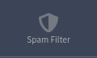

From there, you can add a detection in the Comment Section.   
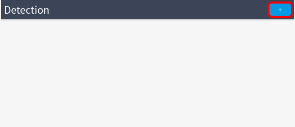

Choose the Forbidden TLDs detection; we will avoid links with the `.finance` and `.shop` domain names.   
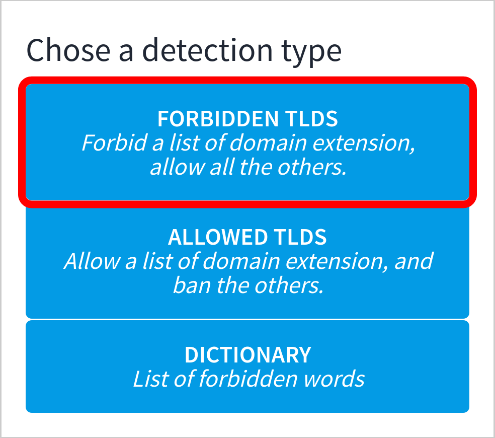

Add: `.finance, .shop` and save.   
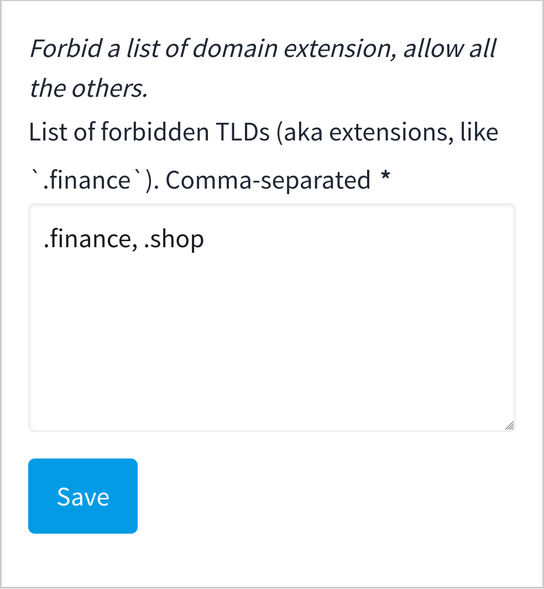

## Set up a spam rule
To be as flexible as possible, this module offers a way to define complex rules.  
For now, we will add just one rule that will forbid the user from saving the comment.

In the Rules > SPAM section, click on the `+OR` sign.   
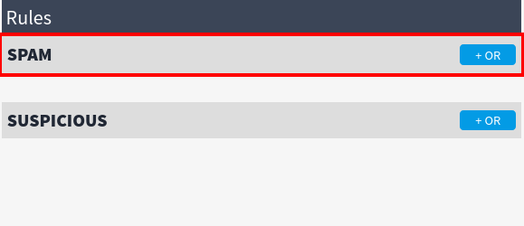

Define the rule to be active when the detection raises a `Forbidden domain extensions (TLDs) found`. Save.   
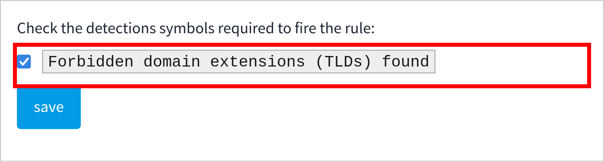

Now, when `.finance` or `.shop` links are detected in a comment, they will pass to the rule with a `Forbidden domain extensions (TLDs) found`. The rule will evaluate as "active" and will continue the flow to the agent section. The agent will define __how to react to this__.

## Define the agent
An agent defines the action to be applied to the user or the comment saved. You can configure what to do in specific situations.

In the Agent > When SPAM section, click on the pencil icon.   
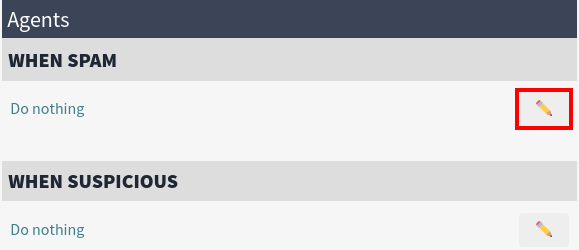

Select the Report agent.   
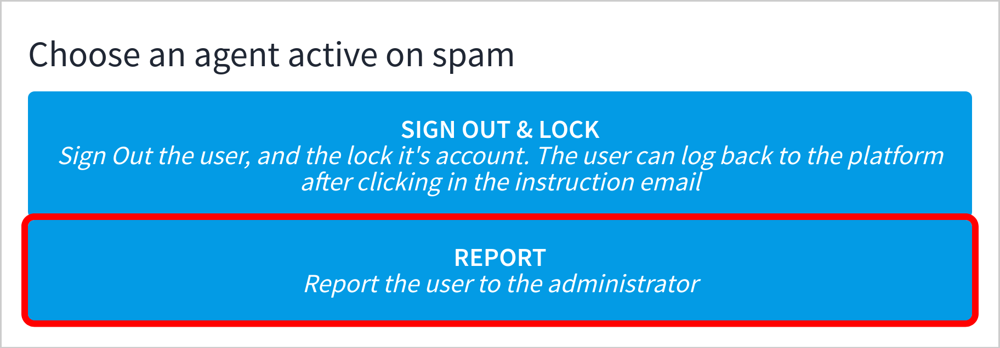

Define the options of the agent. Save. 
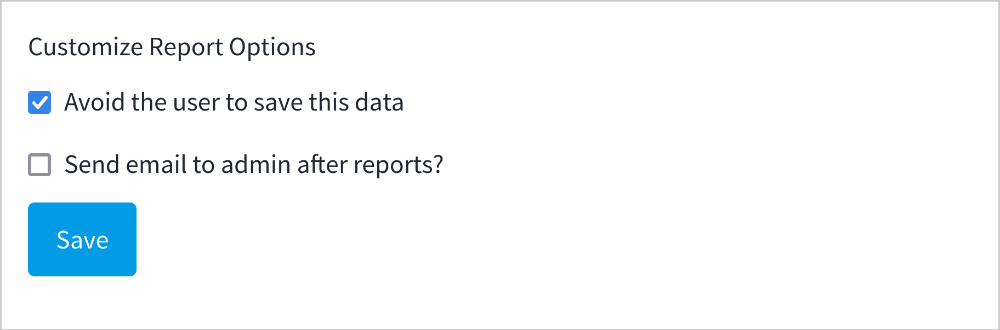

## Conclusion
You can see that from the first flow we designed, we can define it in three simple steps inside the anti-spam module.

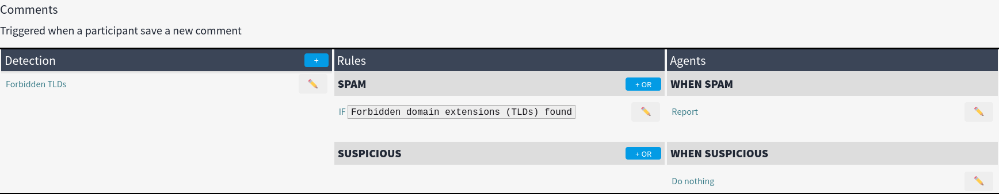

You now have a very basic protection in the comment section of Decidim for some obvious links. You can, of course, improve this configuration to define more complex detections or rules.
