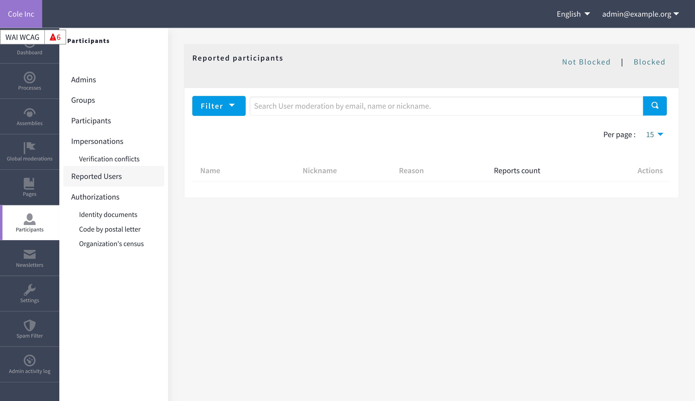

# Report Agent
This agent will report the author of the content. Reported users will then appear in the list of your administration, under the tab Participants > Reported Users.  

**When to use**  
If you want to test a rule or set a non-intrusive detection, you can define the report agent. It is also useful to simply avoid new content from being saved.

**Options**  
- _Avoid the user to save this data_: If checked, the content won't be saved. For comments, for example, this prevents emails from being sent to followers with spam content.
- _Send email to admin after reports?_: If checked, a report will be sent to the email defined by the environment variable `ANTISPAM_ADMIN`.
