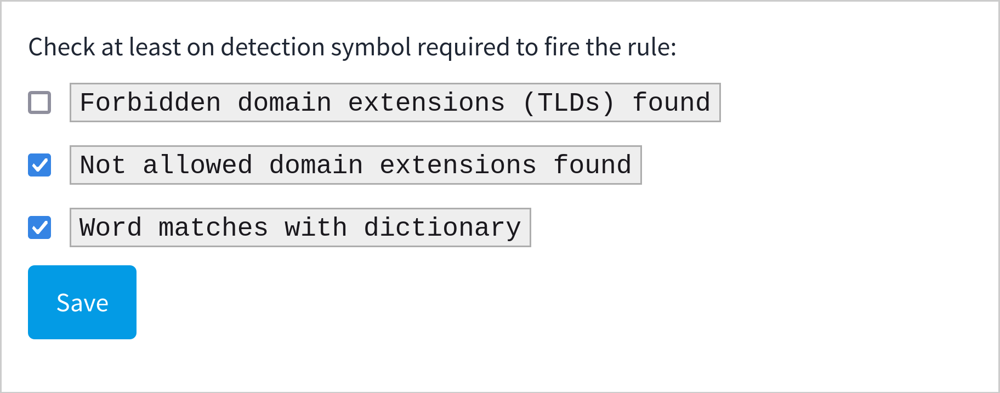
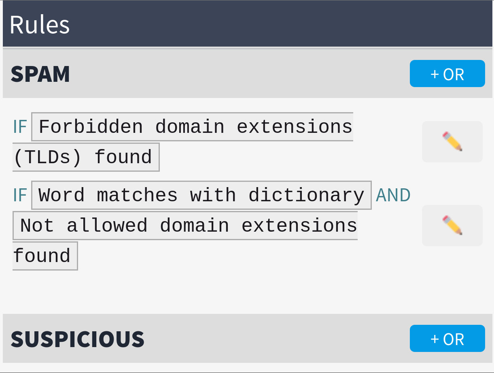

# Rules
A rule receives the output of the detections and can be active or inactive.  
When editing a specific rule, you can define what is needed for the rule to be "active."

For example, here the rule will be active if words are found in the dictionary and a domain that is not in the allowed domains is present:  

This allows strategies to act as "spam" or "suspicious": you can block if spam, and report if suspicious, for example.

If you want to have several rules active at the same time, you can add more rules. It will trigger the agent if one of its rules is active. For example, here we report the user if a word is found and a non-allowed domain is present, OR a forbidden domain is found:  

